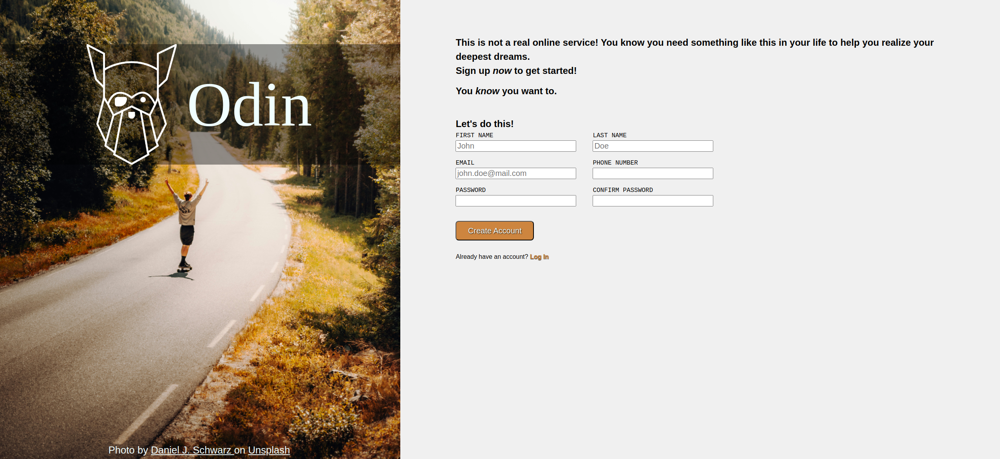

# 📝 Sign-Up Form

This project is part of **The Odin Project's JavaScript curriculum**, where I created a **Sign-Up Form** for an imaginary service. This project allows me to practice my HTML and CSS skills by building a user-friendly form interface.

## 🌟 Features

- A structured and visually appealing sign-up form layout.
- Inputs with different styles for normal, invalid, and focused states.
- A semi-transparent background behind the logo for improved text readability.
- Validation styles for password input fields.

## 🚀 Technologies Used

- **HTML5**: For structuring the form and input elements.
- **CSS**: For styling the layout and inputs.

## 📸 Preview

You can view the sign-up form here: [Live Demo](https://mrswizzer.github.io/odin-signup-form)

## 💡 Learning Outcomes

Through this project, I practiced the following skills:

- Creating a well-structured HTML form with appropriate input fields.
- Styling elements using **CSS** to match design specifications, including hover effects and pseudo-classes.
- Understanding how to layout elements effectively using CSS properties.

---

## 🔗 Acknowledgments

This project was built as part of [The Odin Project](https://www.theodinproject.com/)'s curriculum.
